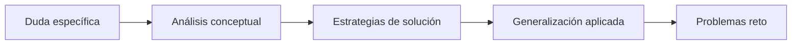

# 🗝️ Academia de Lefay

**Licenciado en Matemáticas y Divulgador** (futuro **Científico de Datos** 🧠)| Apasionado por inspirar y guiar a estudiantes de todos los niveles en el camino del conocimiento matemático.  

[](https://youtube.com/@Academia-Lefay)
[](https://discord.gg/pBddfmv6Zv)

---

## 🌟 Tabla de Contenidos
1. [Propósito Transformador](#-propósito-transformador)  
2. [Audiencia](#-audiencia)  
3. [Dominio Matemático](#-dominio-matemático)  
4. [Servicios](#-servicios)  
5. [Ecosistema Digital](#-ecosistema-digital)  
6. [Únete a la Comunidad](#-únete-a-la-comunidad)  

---

## ✨ Propósito Transformador

> **"No enseñamos matemáticas, cultivamos pensadores críticos"**  

Mi misión es **revolucionar la percepción de las matemáticas** mediante:  
- 🎯 Enseñanza personalizada con enfoque en comprensión profunda  
- 🧠 Desarrollo de pensamiento lógico-creativo  
- 🔒 Adaptación curricular a estilos de aprendizaje  

---

## 🎯 Audiencia

### 👨‍🎓 Estudiantes  
| Nivel | Programas Especializados |
|-------|---------------------------|
| **Primaria** | Fundamentos lúdicos |
| **Secundaria** | Resolución creativa de problemas |
| **Preparatoria** | Preparación para exámenes estandarizados |
| **Universidad** | Tutorías avanzadas por especialidad |

### 👨‍💼 Profesionales  
- Cursos especializados para ingenieros  
- Actualización en matemáticas aplicadas  

---

## 🧮 Dominio Matemático

### 🔢 Matemáticas Fundamentales  
- Álgebra
- Álgebra Lineal
- Geometría Analítica  
- Cálculo (Diferencial • Integral • Vectorial)  
- Física Básica  
- Matemáticas Discretas  
- Variable Compleja  
- Álgebra Abstracta
- Ecuaciones Diferenciales
- Probabilidad
- Estadística
- Teoría de la Información
- Minería de Datos
- Programación Lineal

---

## 💼 Servicios 

### 🎓 Asesorías Académicas  
- 👥 **Sesiones 1:1** con seguimiento personalizado  
- 👨‍👩‍👧‍👦 **Grupos de estudio** por nivel 
- 📊 **Diagnóstico inicial** de competencias  

### 🧩 Soluciones Integrales  


### 📚 Producción de Contenido  
- Guías ilustradas con ejemplos prácticos  
- Banco de problemas clasificados por dificultad  
- Material para preparación de exámenes  

---

## 🌐 Ecosistema Digital

### 📹 YouTube  
[](https://youtube.com/@Academia-Lefay)  
► Tutoriales animados  
► Resolución de problemas paso a paso  
► Series temáticas 

### 💬 Discord  
[](https://discord.gg/pBddfmv6Zv)  
- Canales especializados por materia  
- Soporte 24/7 con sistema de tickets  
- Comunidad activa de aprendizaje

### 🔜 Próximamente  
```diff
+ 📸 Instagram: Visualización de conceptos 
+ 🎵 TikTok: Retos matemáticos 
```

---

## 🚀 Únete a la Comunidad

1. **Explora contenido gratuito**  
   [](https://youtube.com/@Academia-Lefay)

2. **Conecta con otros aprendices**  
   [](https://discord.gg/pBddfmv6Zv)

3. **Agenda tu primera asesoría** → Más información en la comunidad de Discord.  

---

> No memorices fórmulas, domina los principios que las generan.  
> La Academia de Lefay: un lugar donde las matemáticas son más que lógica: son la reminiscencia de todo lo que existe.

---

